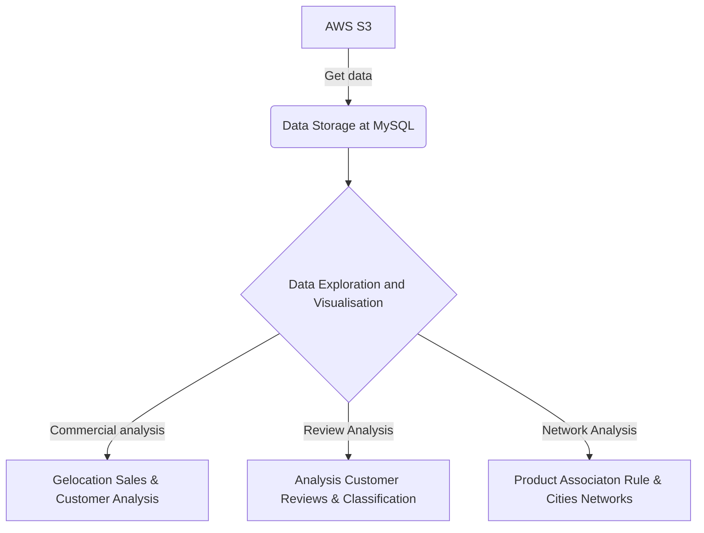
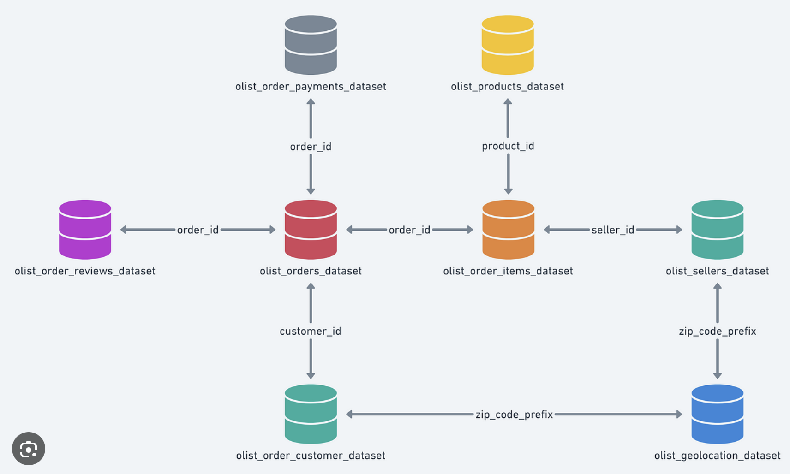

#  E-Commerce by Olist
### Project Overview
This is a public dataset on Kaggle Platform. It was generously provided by Olist which is the largets department store in Brazil. Small businesses are connected by Olist across Brazil to channels without hassle and with a single contract.
Those small business can sell their products through the Olist Store and products are directly shipped to the customers by Olist logistics partners. See more details on the website: www.olist.com.
After a customer place his order from Olist Store, notification sent to seller to let seller complete that order. Once customer receive their product, or after the delivery date, customer could fill in a satisfaction survey by email where he could write down his purchase experience and comments [here](https://www.kaggle.com/datasets/olistbr/brazilian-ecommerce).

### Codes and Resources Used
* Pycharm
* Python 
* PowerBI
* Packages needed: See requirements.txt 

### Project Framework

#### Project Flow Diagram

####  Data Schema

### Results and evaluation
### Tasks
#### 1. Data Visualisation

#### 2. Commercial Analysis
Tables are merged together to form master dataframe. From commercial sales perspective, gelocation sales such as customer city and state are viewd. The output are stored at output/visualisation/commercial. In addition, popular product category by city are found and presented in treee map. Later, customer sales such as rfm and new customer against regular customer are analysied. In the end, DAU will be presented in line chart.

#### 3. Network Analysis (City relationship & Product Association)
* Speaking of customer city and seller city, taking them as nodes, and frequencies between as edges. Relationship betweem cities are presented in network diagram. For the strong relationship with high connection between cities, more deliveries services could be planned in order to increase customer statistication.

* But for product association, an adjacnecy matrix are produced between proucts relationship. Association rules are utilised to help sellers have more bundles in order to attract customer in order to increase sales.  Association rule could tell you what is the probability of buying this product given if customer have already bought other products.

#### 4. Customer Segment
Customer are categorised into various groups. Firstly, customers are categorised regular customer and customer who only buy once on the platform via RFM. Then

customer could be split into New Customer and Regular Customer to see how they purchase products. In addition, RFM segmentation are utilised on customer as well, which is a marketing analysis method that involves analyzing customer behavior based on three key factors: recency, frequency, and monetary value. Later K-Means and DBSCAN methods to categorised customer into various groups.

#### 5. Sentiment Analysis (NLP) 
Reviews left by customers are valuable to improve product quality and service. Bascially, text processing are utilised on customer reviews. Positive or Negative Labels are given by their score. In the end, various classification method are used to split reviews into groups and pick up negative feedbacks to improve in order to provide better service.

